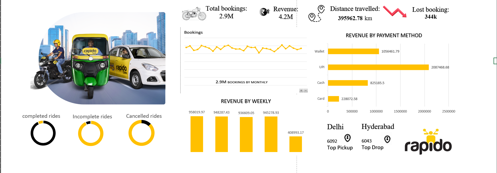

# Rapido Ride Analytics Dashboard (Excel)

An interactive Excel dashboard analyzing Rapido ride data (July 2025 dataset, sourced from Kaggle) to surface trends in ride volume, revenue, and operational performance.

## Dataset
- Source: Kaggle — Rapido rides dataset, July 2025
- Size: [X,XXX rows / X columns]
- Key fields: [e.g. ride date, fare, distance, city, ride status, payment mode]

## What the dashboard shows
- [e.g. Daily/weekly ride volume trends]
- [e.g. Revenue breakdown by city/payment mode]
- [e.g. Peak hours / cancellation rate analysis]

## Tools & techniques
- Microsoft Excel: PivotTables, PivotCharts, [VLOOKUP/XLOOKUP, slicers, conditional formatting — list what you actually used]

## Key insight
[One sentence: the most interesting finding — e.g. "Ride cancellations were X% higher during Y time window" or "City Z accounted for X% of total revenue despite only Y% of rides."]

## Preview

